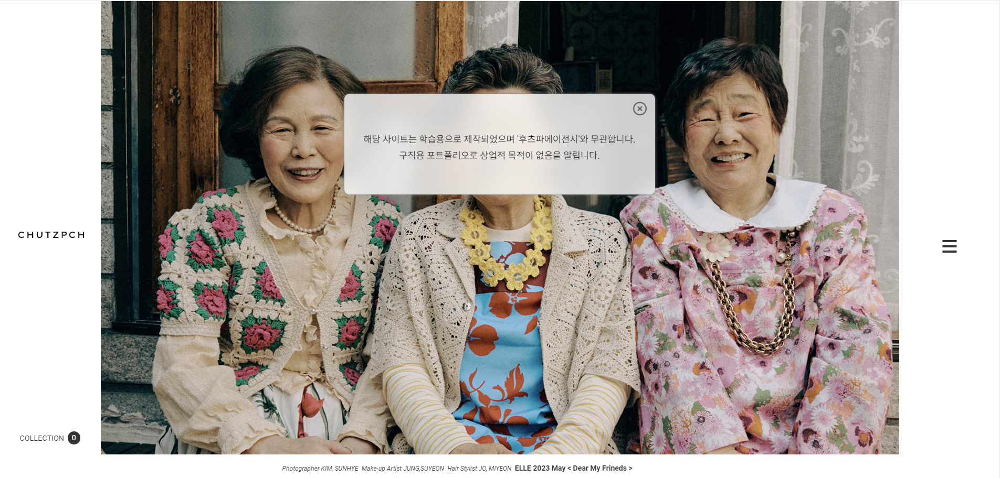
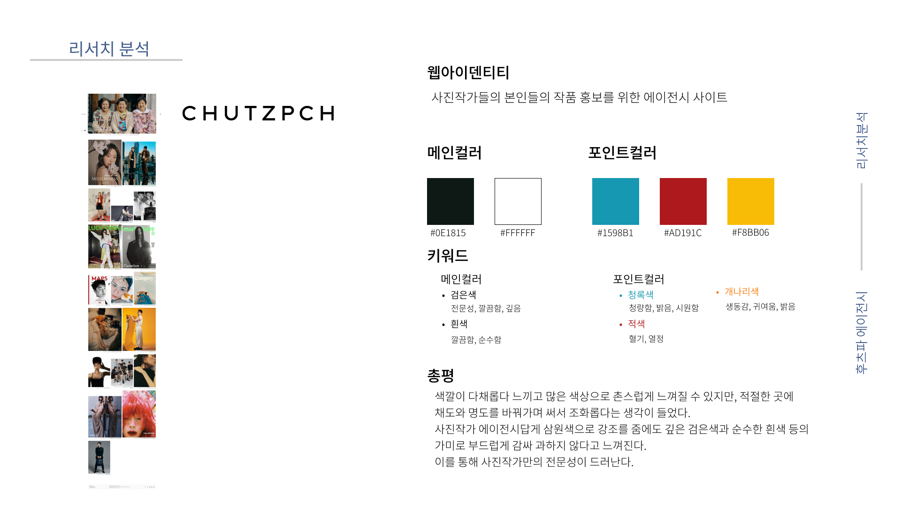

# 프로젝트4 '후츠파에이전시'

▶ 메인 스크린샷

> 기획서 보기

https://drive.google.com/file/d/10kgiCGQ9jfvOjEU1AhWGEX0dZJ47SDB0/view?usp=drive_link

## 목차

- 기획서 보기
- 스타일 가이드
- 로고 리디자인
- 리디자인 프로토타입
- 특징
- 브라우저 호환성
- 기술사양
- 연락처

## 스타일 가이드

▶ 사이트를 분석해 만든 스타일 가이드

## 로고 리디자인

▶ 후츠파로고 리디자인 a -> c

## 특징
- SCSS project
- 반응형

## 브라우저 호환성
- Chrome
- Mozilla
- Opera
- Edge
- Safari

## 기술사양
- HTML5
- SCSS
- jquery-3.7.1.min.js

## 연락처

Created By 1618wlsdk@gmail.com